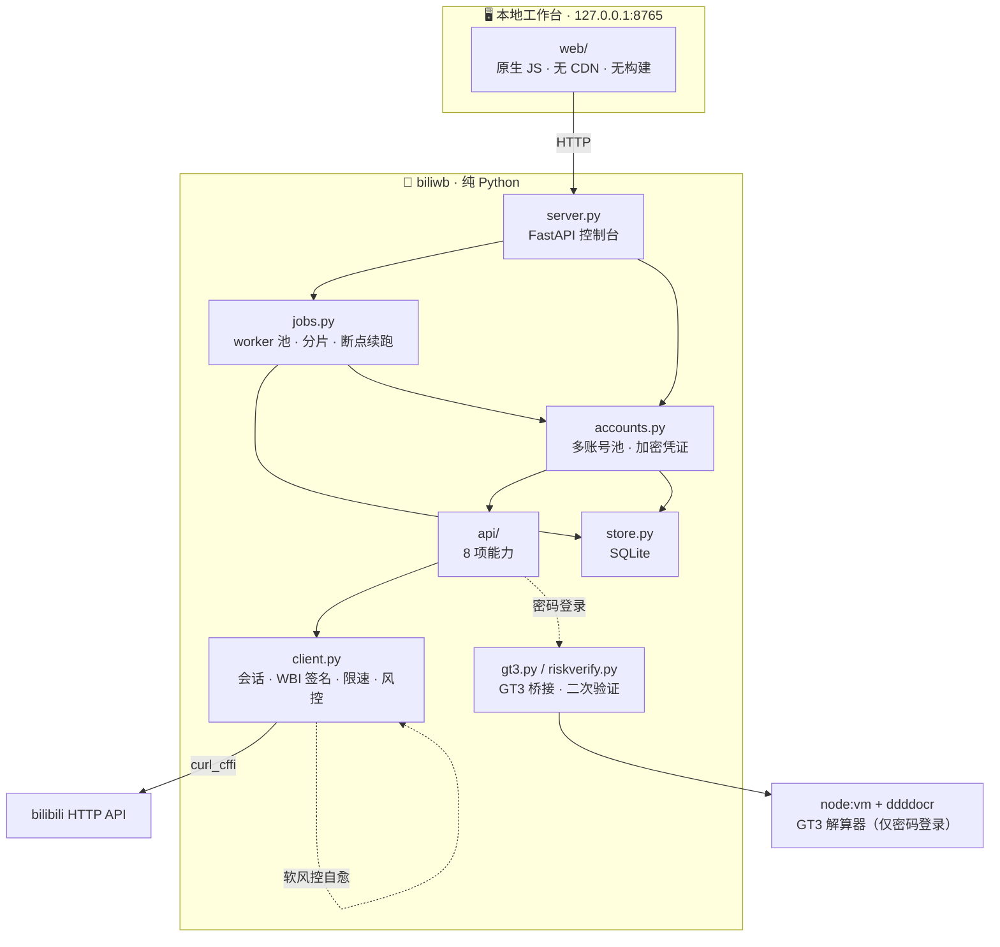

<div align="center">

# 🎬 bilibili 本地批量采集工作台

**纯 Python · 全程无浏览器 · 协议级只读采集**

[](https://www.python.org/)
[](#-为什么值得一看)
[](#-为什么值得一看)
[](#-测试矩阵)
[](#-免责声明)
[](#-密码登录与-gt3-解算)

**扫码登录 → 8 项采集能力 → 多账号批量 → SQLite 落库**

所有 HTTP 都由 Python 自己发出。每一处风控与验证码处理，都是本机实测出来的结论，不是抄来的经验。

</div>

---

## 📖 目录

<details open>
<summary>展开 / 收起</summary>

- [✨ 为什么值得一看](#-为什么值得一看)
- [🚀 快速开始](#-快速开始)
- [💻 界面](#-界面)
- [🧩 8 项采集能力](#-8-项采集能力)
- [🧱 架构](#-架构)
- [🔐 登录与凭证](#-登录与凭证)
- [🧠 密码登录与 GT3 解算](#-密码登录与-gt3-解算)
- [🚧 风控实录（实测数据）](#-风控实录实测数据)
- [🎯 投流 / 接广判定](#-投流--接广判定)
- [💬 弹幕身份还原](#-弹幕身份还原)
- [✅ 测试矩阵](#-测试矩阵)
- [📁 目录结构](#-目录结构)
- [❗ 已知边界](#-已知边界)
- [📜 免责声明](#-免责声明)

</details>

---

## ✨ 为什么值得一看

| | |
|---|---|
| 🚫 **真的没有浏览器** | 运行路径不含 Playwright / Selenium / CDP / 浏览器 profile / headless Chrome。`curl_cffi` 负责 TLS 指纹，Python 负责每一个字节。 |
| 🧩 **自己解验证码** | 极验 GT3 文字点选**纯算法**通过：`node:vm` 跑官方资产 + 本地 OCR 识别字形，不接打码平台。单轮 13~17 秒拿到 `validate`。 |
| 🔬 **实测驱动** | 每个反直觉的行为都有对照实验与回归测试兜底：验证码寿命、软风控成因、分页越界语义…… 文档里所有数字都能用 `tests/` 里的脚本复现。 |
| 🔒 **凭证加密落库** | cookie 与密码走 **Windows DPAPI**（同机同用户才能解）或 Fernet 回退。界面与 API 从不回传凭证本体。 |
| 👥 **多账号 + 分片** | 每账号独立会话 / 限速 / 身份；`shard` 把一个任务按账号切分并行，同账号串行避免风控。 |
| 📖 **只读** | 不发弹幕、不评论、不点赞、不投币。全部是只读采集，连"写操作"的代码路径都不存在。 |

---

## 🚀 快速开始

**Windows 用户：双击 `start.cmd` 就行。**

启动器会自动定位 Python、校验版本（需 3.10+）与依赖；缺依赖时问你要不要装；
启动失败会把窗口留住让你看清原因（最常见是端口被占用）。

手动启动：

```powershell
pip install -r requirements.txt
python main.py                 # 也可以直接右键运行本文件，无需任何参数
```

浏览器会自动打开 <http://127.0.0.1:8765/>。

**第一次登录**：点右上角 **+ 添加账号** → 扫码 → 手机 bilibili 客户端确认。

> 扫码通道**不经过验证码**，cookie 由 passport 直接下发到本地会话 —— 这是推荐路径。

**离线自检**（不联网、不需要登录）：

```powershell
python main.py --selftest      # 25/25
```

**环境要求**

| 组件 | 何时需要 |
|---|---|
| Python **3.10+** | 总是（用到 PEP 604 联合类型语法） |
| `curl_cffi` / `fastapi` / `uvicorn` / `segno` | 总是（见 `requirements.txt`） |
| **node** + `ddddocr` + `opencv-python` | **仅**"账号密码自动登录"需要（跑 GT3 解算器） |

只走扫码 / cookie 的话，**不需要 node、不需要 OCR 依赖**。

---

## 💻 界面

单页工作台，零外部依赖（无 CDN、无构建步骤）。

| 区域 | 作用 |
|---|---|
| 顶栏 | 账号总览、**校验全部账号**、**+ 添加账号** |
| 左栏 | 账号列表（悬停出现：校验 / 扫码 / 密码 / 验证 / 删除）、8 项接口、worker 数（运行时可调 1~32） |
| 主区 | 目标输入、参数、**开始采集**、B 站风格搜索卡片与点击分页 |
| 右栏 | 接口调用链：顺序、HTTP/业务状态、限速等待、网络耗时与总耗时 |
| 批量区 | 目标列表 + 使用账号 + **多账号分片并行** 开关 |
| 底部 | 任务列表、进度、逐目标成功/失败、耗时与调用明细 |

- 批量目标**每行一个**，单任务最多 2000 个
- 同一个 job 支持**断点续跑**（已成功的 target 自动跳过）
- 单次采集结果与批量任务均可直接导出 **UTF-8 CSV**
- 每个分页接口都有 **「抓取页数(≤250)」**：从起始页连续抓 N 页，`items` 合并返回，
  并附带 `per_page` 逐页明细与 **停止原因**

---

## 🧩 8 项采集能力

| # | 接口 | 目标输入 | 关键返回 | 抓取页数 |
|---|---|---|:---:|:---:|
| **2.1** | 综合搜索 | 关键词 | 排序 / 页码 / 每页数量 / 时长筛选 / 日期区间（10 位时间戳，`begin < end`） | ✅ ≤250 |
| **2.2** | 视频详情 | BV 号或链接 | 点赞·投币·收藏·转发、标题、简介、tag、字幕、作者、发布时间、播放量、弹幕量 + **投流/接广判定** | — |
| **2.3** | 视频评论 | BV 号或链接 | 游标分页、二级评论、评论者昵称/UID/等级/时间、点赞数 | ✅ ≤250 |
| **2.4** | 视频弹幕 | BV 号或链接 | 弹幕内容、视频内时间、发送时间、midHash、分段分页 | 分段 |
| **2.5** | 用户资料 | UID / 主页链接 / 准确用户名 | 简介、动态数、视频数、关注数、粉丝数、获赞数、播放数、充电人数、关注/粉丝名单 | 名单 ≤250 |
| **2.6** | 作者视频列表 | UID / 主页链接 / 准确用户名 | 分页（页码 / 每页 / 排序 / 关键词）、投稿总数 | ✅ ≤250 |
| **2.7** | 视频流 | BV 号或链接 | DASH 视频/音频直链 + 清晰度列表 | — |
| **2.8** | 用户动态 | UID / 主页链接 / 准确用户名 | 图文 / 视频 / 转发动态，游标分页 | ✅ ≤250 |

### 「抓取页数」的行为

```
起始页码 = 3，抓取页数 = 5   →   实际请求第 3、4、5、6、7 页
```

返回里始终附带：

| 字段 | 含义 |
|---|---|
| `items` | 各页**合并**后的列表 |
| `count` | 合并后的总条数 |
| `pages_fetched` / `pages_requested` | 实抓页数 / 请求页数 |
| `page_start` → `page_end` | 实际覆盖的页区间 |
| `per_page` | 逐页明细 `[{page, count, is_end…}]` |
| `truncated` | 是否没抓满请求页数 |
| **`stop_reason_text`** | **为什么停**（见下表） |

遇到边界会**自动提前停止**，并明确告诉你原因：

| 停止原因 | 界面文案 | 含义 |
|---|---|---|
| `reached_pages` | 已抓满请求的页数 | 正常完成 |
| **`reached_num_pages`** | **已到服务端结果上限（该关键词只下发这么多页）** | 撞到 bilibili 自己的上限 |
| `empty_page` | 服务端返回空页，没有更多数据 | 真的没数据了 |
| `api_page_mismatch` | 页码越界（服务端把请求页回退了），已停止 | 见 [风控实录](#-风控实录实测数据) |
| `cursor_end` / `no_more` / `no_next_offset` | 接口标记已到末页 / 没有更多数据 | 游标类接口到底 |

> **⚠️ 单关键词搜索最多 1000 条**
> bilibili 搜索接口对每个关键词只下发 `numResults: 1000` / `numPages: 34`（`page_size=30`）。
> 填 100 页也只会拿到 34 页 1000 条，`stop_reason` 会明确写 `reached_num_pages`。
> 想要更多数据只能**换维度**：换排序 / 切时间区间 / 加时长筛选 / 换更具体的关键词。

---

## 🧱 架构



### 并发模型

```
worker 线程池（1~32）  ← 从任务队列取 job
   └─ 每个 job 绑定一个账号
        └─ 账号级锁：同账号串行（避免风控）；不同账号才能真正并行
```

- **实际吞吐 ≈ min(worker 数, 可用账号数)** —— 只有一个账号时加 worker 不提速，也不会更容易被风控
- **`shard` 分片**：把一个 job 的 targets 按可用账号切分，同一 job 内各分片用不同账号，
  因此不受"同账号串行"限制
- 进程重启时，上一进程遗留的 `running` 任务会被自动标记为 `interrupted`（不留僵尸任务）

---

## 🔐 登录与凭证

三种登录方式：

| 方式 | 说明 | 成本 |
|---|---|---|
| **扫码**（推荐） | 不过验证码，cookie 直接落到该账号 | 一次扫码 |
| **粘贴 Cookie** | 从浏览器复制导入，导入后立即校验 | 一次性 |
| **账号密码** | 自动过极验 GT3 | 单轮 13~17 秒；见下 |

**为什么推荐扫码**：密码通道每次都要过验证码，而 `gt/challenge/token` **约 120 秒就失效**；
更关键的是**试错会累积账号/IP 级限流**（`-629`），冷却期内即使验证码过了也登不上。
扫码拿到的 `SESSDATA` 本身就能长期复用 —— **日常靠 cookie，密码只在 cookie 失效时续期**。

### 凭证安全

cookie 与密码**一律加密后存库，本地没有明文**：

| 后端 | 条件 | 说明 |
|---|---|---|
| **Windows DPAPI**（首选） | 有 `pywin32` | 密钥由当前 Windows 用户凭据派生，**只有同机同用户能解**；换机器/换用户即失效 |
| **Fernet + 本机密钥**（回退） | 非 Windows 或缺 pywin32 | `data/.secret.key`（0600）+ AES |

界面与 API **从不回传凭证本体** —— `GET /api/accounts` 只给 `has_cookie` / `has_password`
布尔量与脱敏提示（如 `buvid3****`）。

### 会话有效性

| 机制 | 实现 |
|---|---|
| `bili_ticket`（24h） | 用已知 HMAC 算法**本地自动续签** |
| `SESSDATA`（服务端定有效期） | 加密落库复用，随时可**手动校验** |
| 有效性校验 | `nav` 的 `isLogin/mid/uname` + `passport/cookie/info` 的 `refresh` 提示 |
| 扫码失效 | 状态码 `86038` 自动停止轮询 |

> 本工作台**不实现** cookie 主动 refresh（该流程需要额外 RSA 密钥材料）。
> `cookie/info` 返回 `refresh: true` 时，界面会提示重新扫码。

---

## 🧠 密码登录与 GT3 解算

```
1. GET  passport/x/passport-login/captcha?source=main-fe
       → { type, token, geetest: { gt, challenge } }
         # 必须由**即将提交登录的同一个会话**预取：token 与预取请求绑定
2. 过极验 GT3（node 子进程，复用上一步的 gt/challenge/token）
       → validate；seccode = "<validate>|jordan"
3. GET  passport/x/passport-login/web/key      → { key, hash }
4. RSA PKCS#1 v1.5 加密 (hash + 明文密码)，base64
5. POST passport/x/passport-login/web/login    → cookie 落到该账号会话并加密入库
```

解算器在 `js_reverse_cache/tasks/bili-gt3-solver/`：用 `node:vm` + env-patch 跑极验官方资产，
在 DOM 边界冻结网络，答案由本地 OCR/CV 给出（`ddddocr` + OpenCV 字形匹配 + 旋转搜索）。

**实测：13~17 秒拿到 `validate`（score 14，10~11 次请求）。**

### ⏱️ 验证码是有寿命的 —— 这才是"验证码已过期"的真正原因

登录端**先验验证码、后验账号密码**（不带验证码字段提交会直接返回 `-105`），
而 `gt/challenge/token` 约 **120 秒**后失效：

| 预取 → 提交的间隔 | 服务端判决 |
|---|---|
| 18.6s / 79.6s / 116.2s | ✅ 验证码通过（继续校验账号密码） |
| 160.2s / 169.7s | ❌ `-105` 验证码错误 |

也就是说：**解算慢一点再把 `validate` 交上去，必然被拒**，看起来像随机的"验证码已过期"。
所以实现做了三件事：

- **由提交会话预取** —— token 的签发时刻由我们自己掌握（也更贴近浏览器行为）
- **解算硬预算 75 秒** —— 超预算整轮丢弃，绝不提交注定过期的 `validate`
- **失败自动重来** —— `-105 / -662 / 86038` 判为"验证码这一关"，重新预取 → 重解 → 重提；
  `-400 / -629` 属于账号密码层判决，立即返回、不空转重试

### 📱 `code=0` 但 `status != 0`：服务端要求人工安全验证

浏览器在这个分支执行 `location.replace(data.url)`。**实测 `status=2`** 时 url 落到
H5 页 `/h5-app/passport/risk/verify`，其组件实测文案：

```
"为了您的账号安全，需要验证您的手机号"
"如无法接收短信验证码，请在【我的-客服中心-账号找回】发起账号找回申诉"
校验调用：{ tmp_code, code, verify_type, captcha_key }   // code = 你手机收到的短信验证码
```

**它要求短信验证你绑定的手机号 —— 验证码发到你手机，必须由你本人输入。**
本工具不去绕这一步（那正是它存在的目的），而是把它做成**半自动**：

```
点「密码」→ status=2 → 弹出工作台内的对话框
   ① 点「发送短信验证码」：协议过一次人机验证码（复用 GT3 解算器）→ 短信发到你手机
   ② 在弹窗内输入收到的验证码 → 点「提交验证」（或按回车）
   ③ 协议 x/safecenter/login/tel/verify → x/passport-login/web/exchange_cookie → 落库
```

**全程不离开工作台**：不跳浏览器、不需要复制链接。
接口与参数全部挖自官方前端（`tests/mine_risk_flow.py` 可复现），并有 `tests/test_riskverify.py`
锁死三个校验分支的参数不被改错。

> 触发原因：B 站判定这次**密码登录**有风险 —— 新设备 / 异地 / **短时间多次密码登录失败**。
> 它**只挡密码通道**：同一账号只要扫码成功，采集照常可用。

---

## 🚧 风控实录（实测数据）

传输身份锁定本地 `curl_cffi` 自带的 chrome 大版本，**不套用**浏览器更新的大版本。
两类风控都显式处理，不当成"外部故障"：

| 类型 | 形态 | 处理 |
|---|---|---|
| **硬风控** | `HTTP 412` / `code -352` | 退避重试 |
| **软风控** | `HTTP 200 + code 0`，业务载荷被 gaia 占位符 `v_voucher` 顶掉 | 抛 `SoftRisk`，独立预算多轮重试 + 每轮自愈 |

### 软风控是概率性的，不是"页数深"导致的

交替 A/B 采样（`tests/probe_search_paging_bound.py`、`tests/probe_search_gaia_ab.py`）：

| 自变量 | 软风控命中率 | 结论 |
|---|---|---|
| 冷会话（基线） | 3/5 | 基线 |
| 暖场 + 续签 ticket 后 | 3/5 | ❌ **单次暖场无显著效果** |
| 加 gaia 指纹槽位 | 4/10 vs 5/10（交替） | ❌ **无显著效果** |
| `page=1 / 33 / 34`（界内） | 3/4、2/4、2/4 | ❌ **与页深无关** |
| `page=35 / 39 / 102`（越界） | 1/4、2/4、3/4 | ❌ 越界没有更高命中率 |

**结论**：软风控是会话信誉的**概率性抖动**，命中率约 50~75%，与页深、gaia 槽位、暖场都无关。
页数越多 = 请求越多 = 撞上的**绝对次数**越多 —— 重试耗尽的那几次就是"页数上去就失败"。

所以解法只能是**提高撞上之后还能救回来的确定性**：

- 软风控有**独立重试预算**（`soft_risk_retries=10`，最多 11 次尝试，与普通 `retries=3` 分开计价）。
  按命中率 ≈60% 估算的最终失败率：8 次尝试 1.7% → **11 次 0.36%** → 14 次 0.08%。
  **它不可能归零** —— 概率性的东西预算再高也只是压到千分位；
- 每轮先 `_recover_soft_risk()`：退避 → 续签 `bili_ticket` → 作废 wbi key
  （**只有第一次**做完整会话刷新，因为暖场要拉两个大页面、而它已被实测否定）；
- 检测放宽为"`data` 顶层出现 `v_voucher`"。旧实现只认"`data` **恰好只有一个键**"，
  多键形态会被漏掉，分页循环随即把它当成"已到末页"而**静默丢数据**；
- 实测 `tests/verify_soft_risk_endurance.py`：连打 12 个真实搜索请求（含几十次软风控命中重试）
  **12/12 成功、0 失败**。

### 分页越界是静默的数据错误

`x/web-interface/wbi/search/type` 的 `page` 超出 `numPages` 时，服务端**不报错也不返回空**，
而是**回退 page**（实测 `page=40 → api_page=34`、`page=39/102 → api_page=1`），
返回的是**别的页**的数据 —— 比丢数据更坏。

因此 `search_videos` 会校验 `data.page == page`：起始页越界直接报错并给出真实范围；
后续页越界则停止并标记 `api_page_mismatch`。

作者投稿 `space/wbi/arc/search` 语义不同：`pn` 越界返回**空列表**且 `pn` 不变（正常末页语义）；
但 `pn` 极深（实测 `pn=119`）会撞 **HTTP 412 硬风控**。

评论接口若出现"本页为空 + `is_end=0` + `all_count>0`"这种自相矛盾组合，
结果会带 `suspicious_empty_page` 标记，而不是被当成"没有更多评论"。

### 其他

- `space/wbi/acc/info` 的准入**必要条件**是 gaia 指纹槽位（`dm_img_list` / `dm_img_str` /
  `dm_cover_img_str` / `dm_img_inter`），与 Referer/Origin 无关 —— 单变量消融已证。
  这些值取自 live 样本，作为**显式配置输入**（`biliwb/constants.py`），运行时不读浏览器
- 任务用的 client **创建时就 `bootstrap()`**（补 `buvid3/buvid4/b_nut/_uuid/b_lsid`），
  避免"裸会话"打业务接口
- 默认限速 **1.1s/请求 + 抖动**，批量任务串行

---

## 🎯 投流 / 接广判定

严格按优先级：

```
有 ad 字段特征 ──────────────────────────────→ 投流 ad（与置顶评论无关）
无 ad 字段特征 + 作者本人置顶评论外挂链接 ────→ 接广 promo
两者都没有 ──────────────────────────────────→ organic
```

ad 字段特征的可信度分层：

| 证据 | 强度 |
|---|---|
| URL 命中 `creative_id` / `linked_creative_id` | ★★★★★ 该次访问来自广告位 |
| URL 命中 ≥2 个投放宏 `__CAID__` / `__RESOURCEID__` / `__FROMSPMID__` | ★★★★☆ |
| 页面级 `adData` / `is_ad_loc` / `cm_mark` | ★☆☆☆☆ **必须排除**：实测广告样本与普通样本该字段值完全相同 |
| `copyright` / `adInfo` / `argue_info` | ☆☆☆☆☆ 已显式排除（易误判） |

> **边界（会写进返回值）**：公开 web 端**不存在**"是不是商单（花火任务）"的字段。
> "有投放痕迹"只说明该视频被花钱推过 —— UP 主自费投放（起飞）痕迹完全一样。

> **批量场景必读**：ad 字段特征来自**访问 URL 的查询参数**。批量任务里如果只填 BV 号，
> 就没有 URL 参数可查，判定会退化为"只看作者置顶评论外挂链接"。**要检出投流，
> 请把带参数的原始链接（含 `creative_id` / `caid` 等）作为目标传入。**

<details>
<summary><b>置顶评论怎么取（三个实测坑）</b></summary>

| 坑 | 现象 | 正确处理 |
|---|---|---|
| `data.top` **不是**评论对象 | 它其实是容器 `{admin, upper, vote}`；对它取 `rpid` 永远为空，导致**误判"没有置顶评论"** | 真正的评论体在 **`data.top.upper`**（UP 主置顶）/ `data.top.admin`；`data.top_replies` 作兜底 |
| `member.mid` 是**字符串**，`owner.mid` 是**整数** | `mid == up_mid` **恒为 False**，"是不是作者本人"永远判错 | 统一 `int()` 归一化后再比较 |
| 带货链接只看正文会漏 | 商品卡片在正文里可能只有文字；权威来源是 `content.jump_url` | 从 `jump_url` 取链接，并识别 `extra.goods_item_id` 判为商品卡片 |

**商品卡片自带投放属性**：`extra.goods_prefetched_cache` 内含 `"is_ad_loc":true`、`resource_id`、
`ad_content.creative_id` —— 但它属于**评论商品卡片**的广告属性，**不是视频自身的 ad 字段特征**，
所以仍计入「接广 promo」，额外放在 `ad_verdict.commerce_signals` 供参考。

**真实正样本**（已进端到端测试）：`BV1Pg8Z62E3C` —— 作者本人置顶评论挂了
`https://b23.tv/mall-ahVNe-m5P7`（商品卡片 `goods_item_id=11460521`），判定 `promo`。

</details>

---

## 💬 弹幕身份还原

弹幕接口**不下发**发送者的 uid / 昵称 / 等级，只有 `midHash`（8 位 hex）。
这不是加密问题，是 B 站压根不给这个字段。做法：

1. `midHash` —— 协议原值，必定可得
2. `uid` —— 用候选 uid 池做碰撞还原（`crc32(str(uid))` 正算比对），**命中才回填**
3. `uname` / `level` —— 对命中的 uid 再调 `acc/info`（受 `enrich_limit` 约束）

未命中时字段保持 `null` 并计入 `identity.unresolved`，**绝不猜测**。

<details>
<summary><b>候选池构成与实测命中率</b></summary>

| 来源 | 说明 | 参数 |
|---|---|---|
| 显式传入 | 你自己给的 uid 名单（可跨视频累积） | `candidate_mids` |
| 视频 UP 主 | `view.owner.mid` | 自动 |
| 该视频评论区作者 | 含二级评论，翻 N 页；置顶评论作者也算 | `pool_pages`（默认 5） |

**命中率实测**（同一批请求，池大小是唯一变量）：

| 视频 | 弹幕数 | 池大小 | 命中 |
|---|---|---|---|
| `BV1Dt4y1S7tG` | 1830 | 48 | 2 |
| `BV1pB4y1x7wC` | 1257 | 22 | 1 |
| `BV1woez6TECm` | 3776 | 28 | **58** |
| `BV1BHez6cEEm` | 35 | 12 | 0 |
| `BV1v1gGzqEVP` | 1413 | 43 | 0 |
| `BV1sT4y127SN` | 16530 | 46 | 0 |

**命中率低是常态**：大视频上万条弹幕来自几千个不同用户，而评论区能翻到的 uid 只有几十到几百个，
重叠面很小。命中是"撞上"，不是"必然"。

</details>

### 持久化 midHash 字典（越用越准）

因为 `midHash = crc32(str(uid))` **与视频无关**，一旦确认了一对 `(midHash, uid)`，
就可以在**所有**视频里复用。工作台把它落到 SQLite 表 `midhash_index`：

- 候选池碰撞命中的 → 自动入库
- `enrich` 拿到的昵称/等级 → 回写入库
- 之后任何视频的弹幕先查字典（`identity.index_hits`），再建池碰撞（`identity.pool_hits`）

实测（4 个视频）：第一轮建池碰撞得到 60 条命中；**第二轮完全不再建池**（池里只剩 1 个 UP 主），
仍认出 **63 条**，且全部来自字典 —— 其中 `BV18Bet6SErh` 第一轮 0 命中，第二轮字典认出 3 条。

> **批量采集跑得越多，能认出的弹幕发送者越多。** 字典可用 `GET /api/midhash-index` 查看。

---

## ✅ 测试矩阵

### 离线（不联网、不需要登录）

| 套件 | 覆盖 | 结果 |
|---|---|---|
| `tests/test_local_proofs.py` | BV/AV 往返（含负对照）、输入解析、投流/接广规则、protobuf 弹幕解码、**WBI fixed-input parity** | **25/25** |
| `tests/test_paging_multipage.py` | 抓取页数：上限钳制、多页合并、末页停止、越界语义、停止原因 | **37/37** |
| `tests/test_login_password.py` | 密码登录编排：预算 / 重试 / 各业务码 / `status!=0` 分支 | **20/20** |
| `tests/test_riskverify.py` | 二次验证：三个校验分支、发短信参数、换 cookie 判定 | **19/19** |
| `tests/test_soft_risk.py` | 软风控检测形态、独立重试预算、自愈调用、与普通 `retries` 的分离 | **17/17** |
| `tests/test_paging_guard.py` | 搜索越界回退、投稿末页语义、评论疑似截断标记 | **11/11** |
| `tests/test_midhash.py` | 47 个真实 (uid, midHash) 配对 + 6 个错误候选负对照 | **9/9** |
| | | **合计 138** |

### 联网（需要服务已启动）

| 套件 | 覆盖 | 结果 |
|---|---|---|
| `tests/test_server.py` | 8 项能力端到端（HTTP API） | **9/9** |
| `tests/verify_logged_in.py` | 字幕 / upstat / 关系链 / 评论翻页 / 动态数 / 隐私负对照 / 广告回归 | **16/16** |
| `tests/test_batch.py` | 批量创建、进度、落库、断点续跑、失败隔离 | **14/14** |

### 实测取证工具（可复现）

| 脚本 | 用途 |
|---|---|
| `tests/captcha_ttl.py` | 夹逼验证码 `gt/challenge/token` 的寿命（约 120 秒） |
| `tests/verify_soft_risk_endurance.py` | 软风控耐久：连打真实请求，统计最终失败率 |
| `tests/probe_search_paging_bound.py` | 深分页 / 越界页行为（推翻"页数深导致风控"） |
| `tests/probe_search_gaia_ab.py` | 交替 A/B：gaia 槽位对软风控是否有效 |
| `tests/mine_risk_flow.py` | 从官方前端挖二次验证的接口与参数 |
| `tests/gt3_prefetch_check.py` | 预取 → 解算冒烟（不提交登录） |
| `tests/ocr_local.py` | 本地 ddddocr 读图（视觉后端不可用时的降级路径） |

**两个 oracle 值得一提**：

- **WBI**：oracle 是 live 页面自己发出的 6 条请求，本地纯 Python 实现复算 `w_rid` **6/6 一致**；
  负对照 `__INITIAL_STATE__.defaultWbiKey` **0/6**（证明必须使用 `nav` 下发的 key）
- **midHash**：oracle 是跨 15 个视频的真实配对 —— 池 415 uid × 18084 midHash、
  随机碰撞期望 1.75e-03，`crc32(str(uid))` 命中 **47**，另外 6 个候选（含双重 CRC32 加盐）**全部 0**

---

## 📁 目录结构

```
main.py                     右键运行入口（无需参数）
requirements.txt
biliwb/
  constants.py              端点 / WBI 混淆表 / 错误码语义 / gaia 槽位
  wbi.py                    WBI 签名（纯 Python）
  client.py                 会话 + 引导 + 限速重试 + 风控识别 + 软风控自愈
  login.py                  扫码登录 / cookie 持久化 / 会话校验
  accounts.py               多账号池 / 加密凭证 / 密码登录编排 / 二次验证
  riskverify.py             status=2 短信二次验证（半自动）
  gt3.py                    GT3 解算桥接
  utils.py                  BV↔AV、输入解析、时间格式化
  ad.py                     投流 / 接广判定
  proto.py                  极简 protobuf wire 解析
  errors.py                 错误码语义与异常
  store.py                  SQLite（任务 / 结果 / 记录 / midHash 字典）
  jobs.py                   批量任务队列（断点续跑 / 分片）
  server.py                 本地 FastAPI 控制台
  api/
    paging.py               抓取页数（上限 250）+ 停止原因
    search.py  video.py  comment.py  danmaku.py
    user.py    dynamic.py            其余能力
  web/                      前端（原生 JS，无 CDN）
tests/                       离线 / 联网自检 + 实测取证工具
analysis/                    proof_manifest.json（交付证明清单）
js_reverse_cache/tasks/      逆向取证脚本与固定向量  ← 见下方"免责声明"
data/                        session / DB / 密钥（**不入版本控制**）
```

---

## ❗ 已知边界

1. **商单（花火任务）无字段可查** —— 只能给出"本次访问是否来自广告位"
2. **弹幕发送者身份受限** —— uid 还原率取决于候选池覆盖率
3. **播放数 / 获赞数、字幕、关系链需要登录态**
4. **单关键词搜索结果上限 1000 条**（`numPages=34`）—— 服务端硬顶，只能靠换维度绕过
5. **`arc/search`、`feed/space` 存在一过性 412** —— 暖场与退避后恢复
6. **`feed/space` 的 `total` 字段不可靠**（有 12 条 items 却返回 `"0"`）——
   需要准确动态数时勾选"翻页累计动态数"（实测同一账号：`feed_total`=0 vs `paged_scan`=272）
7. **cookie 主动 refresh 未实现**（需额外 RSA 密钥材料）—— 界面会提示重新扫码
8. **视频直链带时效签名** —— 取到后需尽快使用，且下载时要保持 Referer/UA 一致
9. **软风控无法根除** —— 概率性抖动，预算再高也只能压到千分位失败率
10. **二次验证无法自动化** —— status=2 需要你本人读短信；工具只自动化了它两端的步骤
11. 本工作台**不做任何写操作**（不发弹幕、不评论、不点赞、不投币），全部为只读采集

---

## 📜 免责声明

- 本项目**仅供学习与技术研究**，用于理解 HTTP 协议、WBI 签名、极验验证码与风控机制
- **只读**：不包含任何写操作（发弹幕 / 评论 / 点赞 / 投币 / 关注）的代码路径
- 请遵守 bilibili 的用户协议与 `robots.txt`，**不要用于高频抓取、批量注册、数据倒卖**
- 默认限速 1.1s/请求是刻意的：请勿把它调低到会对目标站造成压力的程度
- **不要把 `data/` 提交到任何仓库** —— 里面有你的登录凭证
- `js_reverse_cache/` 下的 `raw/`、`cache/` 收录了**第三方站点的原始 JS 资产**（极验 SDK、
  passport 前端 chunk）与大量抓包缓存。它们仅用于本地离线复现与对照实验，
  **版权归原站所有**。公开仓库建议不要包含这些文件，只保留你自己写的脚本
- 使用本项目产生的一切后果由使用者自负

---

<div align="center">

**如果这个项目让你对"协议级采集"有了新认识，欢迎点个 ⭐**

<sub>Built with 🐍 Python · No browser was harmed in the making of this tool</sub>

</div>
